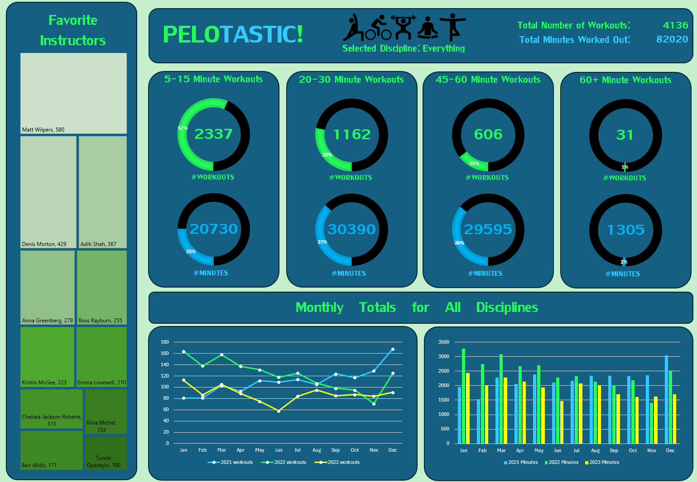
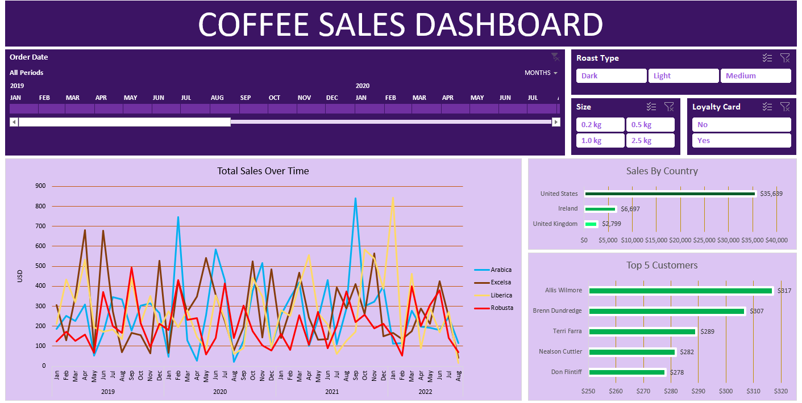
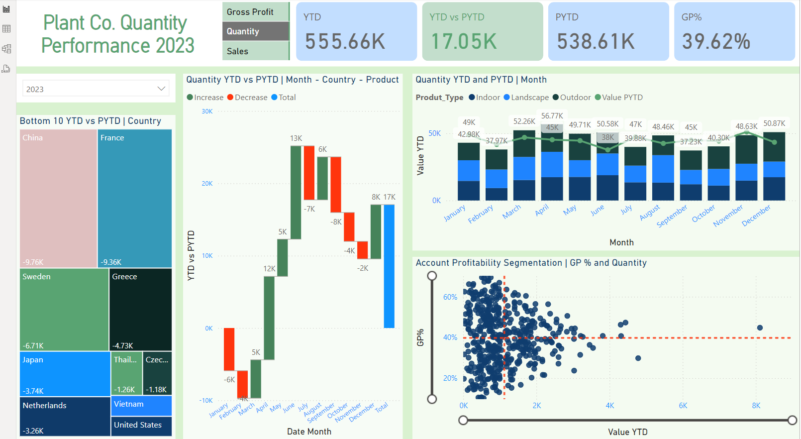

# Dashboard Nation
I've been working on increasing my dashboard skills as well as learning new techniques, as these solo projects are not exceptionally large on their own I have decided to collect them in a single repository as a form of catalogue.

## Excel
**Pelotastic**

This dashboard is based on user data downloaded from Peloton. 

The dashboard includes interactive icons to drill down into specific disciplines, workout totals, all donut charts and the favorite instructors tree map will respond discipline selection. Interesting takeaways from the data are an increase in peloton usage around the new year, as well as the time spent in 20-30 minute workouts being very similar to the amount of time spent in 45-60 minute workouts.

---
**Coffee Orders**

This dashboard is based on a coffee orders data set. 

The dashboard includes several slicers and a timeline that will adjust the data present in all 3 charts present on the dashboard. Significant data merging was done in Excel using formulas to connect seperate worksheets.

---
## Power BI
**Plant Co**

This dashboard is based on a plant sales company data set.

The dashboard includes a slicers to narrow the data by year as well as options to display gross profit, quantity sold and total sales. The data output in the YTD vs PYTD location will change color in reponse to negative/positive values and the bottom right scatter plot includes sliders to allow the user to drill down to specific values.

